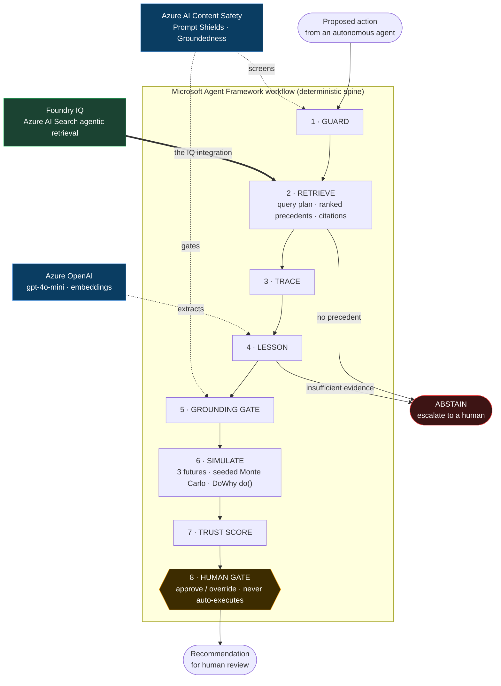

# JANUS

**A decision guardrail for autonomous enterprise agents.**

Before an AI agent executes a proposed action, JANUS intercepts it, checks it
against the organization's recorded past decisions and their outcomes, and returns
a cited, grounded recommendation — approve, modify, or reject — for a human to
sign off. It is decision support with a human in the loop. **It never executes
anything on its own.**


> Built for the Microsoft Agents League @ AI Skills Fest 2026 — Reasoning Agents
> track. **Foundry IQ** (Azure AI Search agentic retrieval) is the real,
> load-bearing intelligence layer.

---

## Why this exists

Enterprises are starting to hand operational decisions to autonomous agents. Those
agents inherit the company's documents and data — but not the lessons it learned
the hard way, the constraints that only became visible after something broke. So
they confidently repeat mistakes the organization already paid for.

Most enterprise-knowledge tools answer questions *when asked*. That's the wrong
moment — by then the agent has usually already decided. JANUS doesn't wait. It
sits in front of the action and intercepts it.

**Everyone else builds a librarian. This is a guardrail.**

## What it does

When an agent proposes an action, JANUS runs an eight-step pipeline on a
Microsoft Agent Framework workflow spine:

| # | Step | What happens |
|---|------|--------------|
| 1 | **Guard** | Content Safety Prompt Shields screen the action *and* the documents about to be read (direct + indirect/XPIA injection). |
| 2 | **Retrieve** | Foundry IQ agentic retrieval plans subqueries, ranks precedents with reranker scores, and returns `[ref_id]` citations. Below the floor → abstain. |
| 3 | **Trace** | For each cited precedent, walk its decision → outcome links in the in-process decision graph. |
| 4 | **Lesson** | Extract one grounded principle, every claim cited. No supporting evidence → abstain. |
| 5 | **Grounding gate** | Content Safety Groundedness Detection blocks a lesson its sources don't support. |
| 6 | **Simulate** | Three futures (approve / modify / reject). The model proposes only bounded levers; a seeded Monte Carlo computes every number, and a DoWhy `do()` intervention quantifies the causal effect. |
| 7 | **Trust** | Compose a score from retrieval confidence, grounding, and decisiveness. |
| 8 | **Human gate** | Pause. A person approves or overrides. Nothing proceeds to execution. |

**The headline beat:** the intercepted action carries a dependency level. Drag it
across the 70% concentration knee and re-run — the recommendation flips from
*modify* to *approve*, because the simulated tail risk genuinely changes. It's a
real causal response to the input, not a scripted animation.

## Architecture



| Layer | Choice |
|-------|--------|
| **Orchestration** | Microsoft Agent Framework — Workflows graph API, typed executors, a real `request_info` human-in-the-loop pause |
| **Retrieval (the IQ layer)** | Foundry IQ / Azure AI Search agentic retrieval — query planning, reranker scores, `[ref_id]` citations |
| **Decision graph** | In-process NetworkX (at this scale a graph server is pure friction) |
| **Simulation** | Seeded NumPy Monte Carlo over a transparent cost model + a DoWhy `do()` causal contrast |
| **Safety** | Azure AI Content Safety (Groundedness + Prompt Shields) + a 22-case eval scorecard + a red-team ASR probe |
| **Backend** | FastAPI + Pydantic v2 on uv |
| **Frontend** | Next.js 15 + Tailwind v4 + React Flow, hand-built SVG charts, over Server-Sent Events |
| **Observability** | OpenTelemetry → Arize Phoenix (local) + Azure Monitor (production) |
| **Auth** | Keyless throughout — `DefaultAzureCredential` / user-assigned managed identity |

Full detail and rationale: [`docs/ARCHITECTURE.md`](docs/ARCHITECTURE.md) ·
product spec: [`docs/PRD.md`](docs/PRD.md) · decisions:
[`docs/DECISIONS.md`](docs/DECISIONS.md).

### Roadmap (labeled as roadmap throughout)

- **Work IQ** and **Fabric IQ** plug into the same knowledge base as additional
  sources, with no pipeline change.
- Durable, crash-resumable workflow state; probabilistic (Bayesian) simulation;
  groundedness reasoning-mode (gated by a model-deprecation issue); the cloud AI
  Red Teaming Agent. One real integration shown working beats three half-wired.

## Safety & reliability

- **Never executes.** JANUS has no execution capability by construction — it emits
  a recommendation. "Never auto-executes" is structural, not a flag.
- **Abstains on thin evidence.** No precedent above the reranker floor, or a lesson
  the model can't ground, → abstain with a depressed trust score. It never
  fabricates a precedent.
- **Real human gate.** The workflow pauses server-side at the approval gate; the
  console resumes the same run over a second request. Double-clicks are idempotent.
- **Measured, not asserted.** A committed red-team probe
  ([`data/eval/redteam.json`](data/eval/redteam.json)) fires direct and
  indirect/XPIA injections at the shields and records the block rate; the
  groundedness scorecard ([`data/eval/scorecard.json`](data/eval/scorecard.json))
  covers 22 cases including the abstain ones.

## Data

The decision corpus is **entirely synthetic** — a fictional logistics company,
fictional vendors, generated transcripts, postmortems, and policies. No real
organizational data, no PII, no secrets are committed. Credentials are resolved at
runtime through managed identity; nothing sensitive lives in this repo.

## Running it locally

> Requires Python 3.11+ (managed with [`uv`](https://docs.astral.sh/uv/)), Node
> 20+, and an Azure subscription with Azure AI Search, Azure OpenAI, and Azure AI
> Content Safety. No Docker required for the core demo — the decision graph runs
> in-process.

```bash
# 1. configure — copy the template and fill in your endpoints
cp .env.example .env

# 2. backend (FastAPI) on :8000
cd api && uv run uvicorn janus.app:app --port 8000

# 3. console (Next.js) on :3100, in a second terminal
cd web && npm install && npm run dev
```

Open the console at `http://localhost:3100`. The backend authenticates to Azure
with `DefaultAzureCredential`, so `az login` is enough locally — there are no keys
in the repo or in `.env`.

To index the corpus into a Foundry IQ knowledge base and run the evidence scripts:

```bash
cd api
uv run python -m janus.scripts.index_corpus   # build the knowledge base
uv run python -m janus.scripts.run_eval       # groundedness + relevance scorecard
uv run python -m janus.scripts.red_team       # injection block-rate probe
```

## Deploying to Azure

```bash
azd up
```

provisions, from the Bicep in [`infra/`](infra/), a Container Apps environment
hosting both services behind a **user-assigned managed identity** with the keyless
data-plane role assignments, **Key Vault**, **Application Insights**, and a
container registry — one reproducible command. The existing AI service endpoints
are passed in via `azd env set` (see [`infra/main.parameters.json`](infra/main.parameters.json)).
The deployed app exists for credibility; the demo is recorded on localhost so a
cold start is never the first impression.

## Repository layout

```text
api/     FastAPI service — the JANUS pipeline, clients, simulation, scripts
web/     Next.js console
infra/   Bicep + azure.yaml for `azd up`
data/    synthetic decision corpus + the eval scorecard + the red-team artifact
docs/    PRD, architecture, decisions, changelog
```

## License

[MIT](LICENSE).
