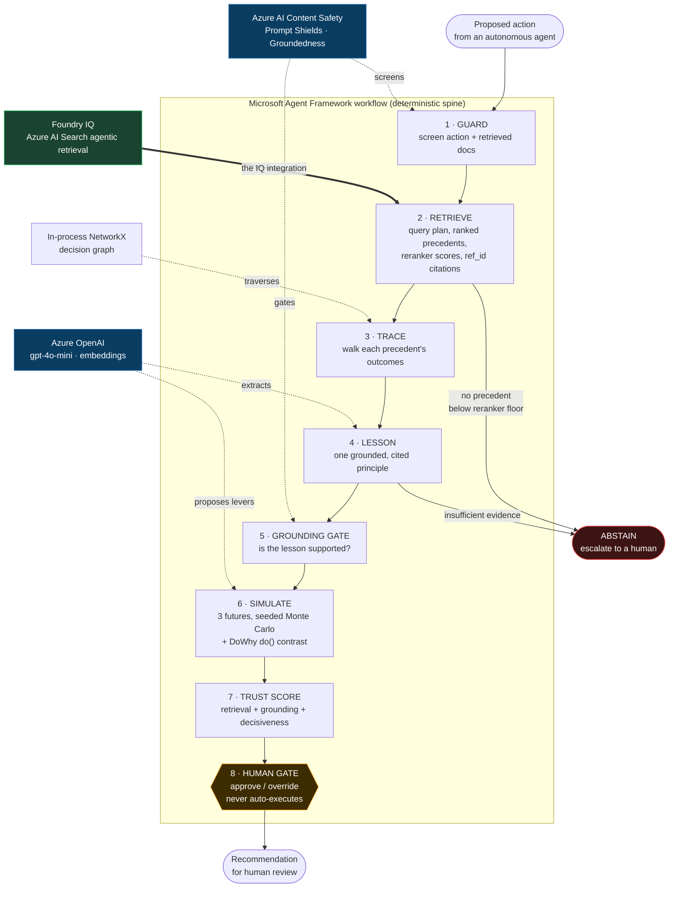

# JANUS — Architecture

*Last updated: 2026-06-11. Versions verified current as of June 2026.*

This document pins the stack, explains why each piece was chosen over its closest
alternative, and records the edge cases and integration seams that the design has
to respect. It is the reference the build follows.

## 1. Shape of the system

JANUS is a deterministic six-step pipeline that sits between an autonomous agent
and the action it wants to take. A Python service runs the pipeline; a Next.js
console renders it as it happens. Foundry IQ is the one real Microsoft
intelligence layer. Everything else is chosen to keep that integration central
and the reasoning visible.

**Spine** — Microsoft Agent Framework Workflows (graph API). **Backend** — FastAPI
with Pydantic v2 on uv. **Frontend** — Next.js 15, Tailwind v4, and React Flow 12
with hand-built SVG charts, over SSE. **Observability** — OpenTelemetry to Arize
Phoenix (local) and Azure Monitor (production). **Roadmap (drawn, not built)** —
Work IQ and Fabric IQ as added knowledge sources, durable checkpointing,
probabilistic simulation, groundedness reasoning-mode, a red-team ASR artifact.

## 2. The chosen stack

*Every choice below was re-audited against the full field of current alternatives
(see `docs/DECISIONS.md`). The rows marked ‡ changed in that audit.*

| Layer | Choice (as built) | Pinned | Closest alternative (and why not) |
|-------|-------------------|--------|-----------------------------------|
| Orchestration | Microsoft Agent Framework, Workflows graph API — typed `Executor` nodes, edges, fan-out/fan-in, and a `ctx.request_info` human-in-the-loop pause | `agent-framework==1.8.1` (pinned exactly; decorator validation is version-sensitive) | LangGraph — co-equal on graphs/HITL, but third-party; demotes Foundry to a bolt-on |
| Retrieval (the IQ layer) | Foundry IQ knowledge base on Azure AI Search agentic retrieval via `KnowledgeBaseRetrievalClient`, 2026-05-01-preview, `answerSynthesis` + `include_activity` | `azure-search-documents>=11.7.0b2` | Hand-rolled hybrid pipeline — loses the mandatory-IQ point. The `agent-framework-azure-ai-search` bridge is present only as a version pin; it doesn't expose the activity/citation detail, so the raw client is the path. |
| Decision graph ‡ | NetworkX in-process `DiGraph` loaded from corpus frontmatter; precedents joined by `doc_id`, outcomes traversed by BFS | `networkx>=3.4` | Neo4j/Memgraph — a graph server earns nothing at ~19 nodes; pure setup friction + a demo-failure surface. Kuzu archived Oct 2025. A `GraphStore` seam keeps a server swap one class away. |
| Simulation ‡ | LLM emits bounded levers only (Pydantic schema) + seeded NumPy Monte Carlo, SciPy triangular; thin **DoWhy GCM** for a literal `do()` counterfactual contrast | NumPy 2.x, SciPy 1.15, DoWhy 0.14 | PyMC Bayesian is roadmap. (SALib Sobol was considered for an offline sensitivity panel and cut to keep the live path lean.) |
| Frontend | Next.js 15 (App Router) + Tailwind v4 + React Flow 12 (`@xyflow/react`); charts and gauges are hand-built SVG; SSE transport | `@xyflow/react` 12.8.6, Next 15.5.19 | A charting library (Recharts/Tremor) was dropped: hand-drawn SVG renders a range that crosses zero, which a stacked bar can't, and removes a dependency. Tremor is React-18-only/unmaintained — non-starter. |
| Safety + eval | Content Safety Groundedness Detection + Prompt Shields (direct + indirect/XPIA); offline scorecard via **azure-ai-evaluation** (Groundedness + Relevance, 22 cases) + a committed red-team ASR probe against the shields | `azure-ai-evaluation>=1.17` | The offline judge is the same Content-Safety-aligned groundedness, so the scorecard predicts live behaviour. The red-team probe is local and Azure-native; the cloud AI Red Teaming Agent (PyRIT) is roadmap — it needs a cloud Foundry project and risks a dependency clash. |
| Backend / infra | FastAPI + Pydantic v2 + uv; `azd` → Container Apps hosting **both** services; Key Vault + user-assigned managed identity; Bicep IaC | FastAPI 0.115+, uv | Static Web Apps dropped — hosting the console as a second container app means one deploy target, one identity model, and no Vercel-ToS question |
| Observability | OpenTelemetry, dual sink: **Arize Phoenix** (local, on-camera trace UI) + **Azure Monitor / App Insights** (production), OpenAI auto-instrumented via OpenInference | `opentelemetry-sdk`, `openinference-instrumentation-openai`, `azure-monitor-opentelemetry-exporter` | App Insights alone has 1–3 min ingestion lag — too slow to show live; Phoenix is the on-camera view, App Insights the production sink. Both sinks are optional: no collector configured → spans recorded, nothing shipped. |

## 3. Why these, specifically

**Orchestration — Microsoft Agent Framework.** JANUS is a fixed six-step
pipeline, not an open-ended autonomous agent. That is exactly the case
Microsoft's own docs say to model as a *workflow*, not an agent: well-defined
steps, explicit control over execution order. The graph API gives typed message
routing, conditional edges (the abstain branch), fan-out/fan-in (the three-future
simulation), and a human-in-the-loop request primitive that maps one-to-one onto
"never auto-executes." It is the first-party SDK for Azure AI Foundry Agent
Service, it emits OpenTelemetry traces into Foundry Observability with no extra
wiring, and it is the GA successor that absorbed AutoGen and Semantic Kernel
(both now maintenance-only — reaching for them would signal we missed the
convergence). For a panel of Microsoft product teams on the Foundry track, this
keeps Foundry at the architectural center rather than bolting it on.

**Retrieval — Foundry IQ agentic retrieval.** This *is* Foundry IQ's engine, so
using it is the most authentic possible integration, not a wrapper around one.
One API call delivers four things the rubric rewards: query planning (visible
subquery decomposition — the multi-step reasoning beat), grounded synthesis with
inline `[ref_id:N]` citations (accuracy), reranker scores in the activity array
(the ranked-list-with-near-misses beat), and a documented abstention pattern
(reliability). The synthesis and planning visibility are preview-only; the client
is built behind an interface that degrades to the GA extractive path, and the
recorded demo replays a real captured response so a preview hiccup can't ruin it.

**Decision graph — in-process NetworkX, kept deliberately small.** The graph is
~19 corpus nodes loaded from the decision records' frontmatter, with edges drawn
from each record's `related:` links. It does not overlap Foundry IQ: IQ does
unstructured semantic retrieval over prose; the graph holds the
decision→outcome→principle structure that flat retrieval can't express. The flow
is IQ-first (find candidate precedents) then graph-second (traverse their
outcomes via BFS). At this scale a graph server earns nothing, so the graph is an
in-process `DiGraph` loaded once at startup, serialized straight to the React
Flow render. A `GraphStore`-style seam keeps a server swap one class away if
scale ever changed. Precedents are joined to graph nodes by the `doc_id` in each
retrieved blob's frontmatter snippet, since the blob knowledge source doesn't
expose a document key. (A richer typed-edge taxonomy —
caused/prevented/contradicted/reinforced — and contradiction/staleness handling
are roadmap; today edges are the untyped `related:` links.)

**Simulation — numbers the judges can't dismiss as fake.** The failure mode to
avoid is hand-authored figures. So the language model never emits a final number;
it emits qualitative levers and bounded parameters under a JSON schema, and a
seeded deterministic Monte Carlo over a transparent cost model computes
everything. Identical inputs reproduce identical output, and changing the
dependency lever provably moves the result across the concentration knee — that
lever is operator-set (it's the action's actual parameter), not an LLM output, so
the flip is a real causal response, not a model guess. A DoWhy `do()` intervention
quantifies the dependency→resilience-loss effect. Every run is hashed into a
manifest. This is the rare hackathon claim that is independently reproducible.

**Frontend — a thin, native-feeling SSE console.** The Next.js App Router console
binds directly to an SSE stream of typed step events from the Python backend, so
there's no Node agent loop to maintain and one source of run state. The panels —
a chain-of-thought step log, citation chips, the precedent graph, the outcome
bands, the trust gauge, the approval gate — are built on Tailwind v4 with React
Flow for the graph and hand-drawn SVG for the charts and gauge (a charting
library was dropped: a hand-drawn scale renders an outcome range that crosses
zero, which a stacked bar can't, and it removes a dependency).

**Safety — one Microsoft-native story.** Content Safety Groundedness Detection
flags an extracted principle that isn't supported by its sources and drives
abstention (binary mode today; segment-level reasoning mode is roadmap, gated by
a model-deprecation issue — see §3a). Prompt Shields screen both the action and
the retrieved docs (direct + indirect/XPIA). The offline azure-ai-evaluation
harness uses the *same* Content-Safety-aligned groundedness, so the committed
scorecard and the live gate measure the same thing — no drift between eval and
production. A guardrail that hasn't been attacked is a red flag, so a committed
red-team probe (`janus.scripts.red_team`) fires direct and indirect/XPIA
injections at the Prompt Shields and records the block rate, with clean inputs to
catch over-blocking. The broader cloud AI Red Teaming Agent (PyRIT) is roadmap —
it needs a cloud Foundry project and risks a dependency clash with the agent
stack, so the local probe is the committed evidence for now.

**Infra — Microsoft-native and demo-proof.** FastAPI is the framework in
Microsoft's own Foundry Agent Service Python samples; its OpenAPI surface is how
a Foundry agent would call JANUS. `azd up` provisions a Container Apps environment
hosting both services, a user-assigned managed identity with the data-plane role
assignments, Key Vault, and Application Insights from one command (Bicep), so the
repo demonstrates real, reproducible IaC. The deployed app exists for credibility;
the recorded video runs off localhost so a cold start can never be the first
impression.

## 3a. Built reality (Phase 1) — where the build diverged from the plan

A few things the live build settled that the plan above couldn't:

- **Knowledge source is an Azure Blob source, not a file-upload source.** The
  `FileKnowledgeSource` (direct upload) is a 12.1-line feature; the SDK in the
  environment is `azure-search-documents 11.7.0b2` (the line the agent-framework
  Azure-AI-Search package pins), which exposes `AzureBlobKnowledgeSource` instead.
  So the corpus is uploaded to a blob container and the knowledge base points at
  it. Same outcome — an auto-vectorized, semantically-ranked index — one extra
  storage account.
- **The search service had to be switched off api-key-only auth.** It shipped as
  `apiKeyOnly`, so keyless Entra tokens were rejected (403) regardless of role
  assignments. Set to `aadOrApiKey` to make `DefaultAzureCredential` work. This
  is why an early key-based detour appeared to be the only thing that worked.
- **The Foundry bridge isn't used.** `agent-framework-azure-ai-search` doesn't
  return structured citations/activity, so the raw `KnowledgeBaseRetrievalClient`
  is the retrieval path. The bridge only matters as a dependency that pins the
  search SDK version.
- **Groundedness reasoning mode is gated by model deprecation.** Reasoning mode
  needs gpt-4o 0513/0806, both in a deprecating state (can't deploy new). gpt-4o
  2024-11-20 is deployed; the gate runs in binary (non-reasoning) mode until the
  reasoning model question is resolved — still blocks ungrounded lessons.
- **Keyless everywhere.** No API keys in code or `.env`; `DefaultAzureCredential`
  throughout, REST bearer tokens for Content Safety.

## 4. The non-obvious integration seams

These are the places where two layers interact in a way that isn't visible from
either one alone. The build must respect all of them.

1. **One agent loop only.** The Microsoft Agent Framework workflow in Python is
   the sole orchestrator. Next.js is a pure presentation client over SSE. We do
   not add a Node agent loop to borrow the AI SDK's approval primitive — that
   would create two sources of run state and a second runtime.

2. **Workflow state across the approval round-trip (the #1 risk).** Resuming a
   paused workflow needs the *same in-memory workflow object*. But "approve" is a
   second HTTP request, and scale-to-zero or a second replica would evict that
   object between the two requests. Solution: FastAPI holds a server-side run
   registry keyed by run id; the demo runs with `min-replicas=1` and a single
   revision; the recording runs on localhost. We do **not** rely on workflow
   checkpointing for this — it re-runs the first executor on resume and re-rolls
   the simulation, so it is roadmap, not a demo feature.

3. **Preview vs GA downgrade.** Query-planning visibility and synthesized
   citations exist only in the preview API; the citation array and reranker gating
   exist in both. If the preview retrieve is unavailable the pipeline surfaces a
   failed retrieval rather than silently degrading. (A graceful GA-extractive
   fallback that flags "GA fallback" in the trace is roadmap — today retrieval is
   preview-or-fail.)

4. **Deterministic seeding under fan-out.** Each simulation branch seeds its RNG
   from the run id, not a global seed, so if the framework re-executes a branch
   the numbers reproduce exactly. The seed goes in the run manifest.

5. **Package fragility.** Pin `agent-framework==1.8.1` exactly (decorator
   validation is version-sensitive) and the tested `azure-search-documents`
   pre-release that exposes the messages-input knowledge-base client. The graph is
   in-process NetworkX, so there is no graph-driver pin to manage.

## 5. Edge cases

**Handled today:**

- **No precedent.** Retrieval returns nothing above the reranker floor → abstain,
  depress the trust score, recommend human review. Never fabricate a lesson. This
  is the single most important credibility moment.
- **Hallucinated lesson.** The Groundedness Detection gate flags a lesson that
  isn't supported by its sources and blocks it from being presented as
  authoritative (binary mode today; segment-level highlighting is roadmap).
- **Thin evidence.** A lesson the model can't ground in the records returns
  `INSUFFICIENT EVIDENCE` and abstains rather than inventing a principle.
- **Indirect prompt injection via org history.** Retrieved decision docs are
  untrusted; Prompt Shields screen them, not just the action, and flagged docs are
  dropped before they reach the lesson step.
- **Never executes.** JANUS has no execution capability by construction — it emits
  a recommendation to a human. "Never auto-executes" is structural, not a flag.
- **Demo-day resilience.** Record on localhost; `min-replicas=1` so the in-memory
  workflow survives the approval round-trip; the eval scorecard (22 cases) and the
  red-team ASR artifact are committed so the reliability evidence exists even if a
  live run is flaky.
- **Measured against attack.** A committed red-team probe (`data/eval/redteam.json`)
  fires direct and indirect/XPIA injections at the Prompt Shields and records the
  block rate, with clean inputs to check for over-blocking — so the safety claim
  is measured, not asserted.

**Roadmap (designed, not yet built):**

- **Partial retrieval → fail loud.** Treat an incomplete knowledge-source result
  as a reason to abstain on compliance-critical flows rather than ground on it.
- **Conflicting precedents.** Surface two opposite-outcome precedents with their
  weights instead of averaging them into one misleading answer.
- **Contradiction & staleness.** Typed `contradicted` edges and down-weighting /
  badging of superseded principles (needs the typed-edge taxonomy above).
- **Captured-fixture replay.** A committed real-response fixture per external call
  so the demo can run fully offline.
- **Cloud red-teaming.** The Azure AI Red Teaming Agent (PyRIT) for a broader,
  automated attack sweep — the local probe is the committed evidence today.

## 6. Risk register (load-bearing first)

| Risk | Severity | Mitigation |
|------|----------|------------|
| Workflow state lost across the approval round-trip | High | Server-side run registry; `min-replicas=1`; record on localhost |
| Headline reasoning beat depends on a no-SLA preview API | High | Replay a real captured fixture in the video; keep live path wired; detect + flag GA downgrade |
| Azure region / quota / RBAC friction in the final 72h | High | Verify one region supports all services on day 0; run eval + red-team day 1; commit artifacts |
| Package fragility across the Python agent stack | Medium | Pin all three; write SEARCH-clause Cypher from line one; smoke-test day 0 |
| Custom HITL gate under-budgeted (~half a day) | Medium | Explicit Phase-3 budget; not promised as a built-in |
| Overclaiming the simulation citation to a panel that will read it | Medium | Cite the paper as inspiration; the seeded RNG + manifest is the real proof |
| Indirect injection through org history | Medium | Prompt Shields on retrieved docs; synthetic-only corpus |
| Scope creep across six layers in three days | Medium | Enforce the cut list; one scenario end to end beats breadth |

## 7. What is explicitly cut (and why it's safe to cut)

Recorded in `docs/DECISIONS.md`. In short: Work IQ / Fabric IQ (roadmap, plug
into the same knowledge base later), durable checkpointing (roadmap), a charting
library (hand-built SVG instead), PyMC Bayesian simulation (roadmap), red-teaming
(roadmap — needs a cloud Foundry project), Static Web Apps (the console ships as a
second container app instead), and multi-scenario breadth (one polished scenario
end to end).

## 8. Verdict

The stack is coherent, current as of June 2026, and maps directly onto the
rubric. There is exactly one non-obvious load-bearing seam — workflow state
across the approval round-trip — and the design respects it. With the cut list
enforced and the IQ and safety beats built first, this is buildable in three days
and competitive on Reasoning, Reliability & Safety, and Creativity.
